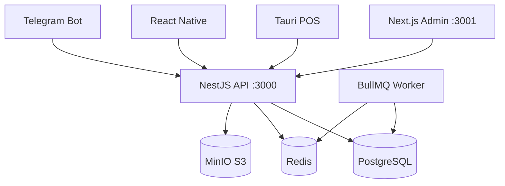

# Codebase Documenter

Generates comprehensive documentation that new developers can use to onboard independently.

## User Arguments

```
$ARGUMENTS
```

- Default: full project documentation
- Specific module: `module:catalog`, `module:payments`, `module:inventory`
- Specific app: `app:api`, `app:web`, `app:pos`
- Specific concern: `architecture`, `data-models`, `api-endpoints`, `setup`

## Workflow

### Phase 1 — Structure Mapping

```bash
# Project structure
find . -type f -name "*.ts" | grep -v node_modules | grep -v dist | head -100

# Module list
ls apps/api/src/

# Key entry points
find . -name "main.ts" -o -name "app.module.ts" | grep -v node_modules
```

### Phase 2 — Read Critical Files

- `README.md` — existing documentation
- `CLAUDE.md` — project rules and architecture
- `prisma/schema.prisma` — data models
- `apps/api/src/app.module.ts` — module structure
- `apps/web/src/app/` — page structure
- `docker/docker-compose.yml` — infrastructure

### Phase 3 — Pattern Identification

```bash
# API endpoints
grep -rn "@Get\|@Post\|@Put\|@Delete\|@Patch" apps/api/src/ --include="*.ts" | grep -v spec

# Services
find apps/api/src -name "*.service.ts" | grep -v spec

# React pages
find apps/web/src/app -name "page.tsx"

# Shared types
find packages/types/src -name "*.ts"
```

### Phase 4 — Generate Documentation

Save to `docs/CODEBASE.md` (or module-specific file):

```markdown
# RAOS — Codebase Documentation
Generated: YYYY-MM-DD

## 1. Project Overview

**Purpose**: Multi-tenant retail management system for Uzbekistan
**Users**: Admins, Cashiers, Warehouse staff, Owners
**Key Features**: POS, Inventory, Sales, Payments, Nasiya, Reports

**Tech Stack**:
- Backend: NestJS + Prisma + PostgreSQL (port 3000)
- Frontend: Next.js + Tailwind + React Query (port 3001)
- POS: Tauri + SQLite (offline-first)
- Queue: BullMQ + Redis
- Storage: MinIO S3

## 2. Architecture



**Domain Modules:**
- Identity & RBAC — auth, users, roles, tenants
- Catalog — products, categories, variants, suppliers
- Inventory — stock movements, warehouses, transfers
- Sales — orders, order items, shifts
- Payments — payment intents, split payments
- Ledger — double-entry journal (immutable)
- Tax & Fiscal — fiscal receipts, tax rules
- Nasiya — credit/installment payments
- Promotions — discounts, campaigns
- Reports — analytics, dashboards

## 3. Directory Structure

```
apps/
  api/src/
    auth/           — JWT, guards, strategies
    users/          — User CRUD, profile
    catalog/        — Products, categories
    inventory/      — Stock, warehouses
    sales/          — Orders, POS operations
    payments/       — Payment processing
    ledger/         — Financial journal
    nasiya/         — Credit payments
    promotions/     — Discounts
    reports/        — Analytics
    common/         — Shared utilities, decorators
  web/src/
    app/(admin)/    — Admin panel pages
    components/     — Shared UI components
    hooks/          — React Query hooks
    lib/            — API client, utilities
prisma/
  schema.prisma     — Database schema
packages/
  types/            — Shared TypeScript types
  ui/               — Shared UI components
```

## 4. Key Components

### Authentication Flow
```
Login → JwtStrategy → JwtAuthGuard → RolesGuard → Controller
JWT: { userId, tenantId, role } — 15min access + 7d refresh (httpOnly)
```

### Multi-tenant Pattern
```typescript
// Every query must include tenantId
this.prisma.product.findMany({
  where: { tenantId: user.tenantId, ...filters }
})
```

### Event-Driven Flow
```
SaleCreated →
  DeductInventory (InventoryService)
  CalculateTax (TaxService)
  GenerateLedgerEntries (LedgerService)
  TriggerFiscalReceipt (FiscalService — async)
  SendNotification (NotifyService — Telegram)
```

## 5. Data Models (Key Tables)

See `prisma/schema.prisma` for full schema.

Key relationships:
- Tenant → Users, Products, Orders, LedgerEntries
- Order → OrderItems → Products
- StockMovement → Product + Warehouse (movement-based, no snapshot)
- LedgerEntry — immutable, only reversal allowed

## 6. API Endpoints

Base URL: `http://localhost:3000/api/v1`

| Module | Endpoints |
|--------|-----------|
| Auth | POST /auth/login, POST /auth/refresh, POST /auth/logout |
| Products | GET/POST /catalog/products, GET/PUT/DELETE /catalog/products/:id |
| Orders | GET/POST /sales/orders, POST /sales/orders/:id/complete |
| Payments | POST /payments/intent, POST /payments/:id/confirm |
| Stock | GET /inventory/stock, POST /inventory/movements |

## 7. Development Setup

```bash
# 1. Infrastructure
docker-compose up -d

# 2. Dependencies
pnpm install

# 3. Database
cd apps/api && npx prisma migrate dev && npx prisma generate

# 4. Dev servers
pnpm --filter api dev        # :3000
pnpm --filter web dev        # :3001
pnpm --filter worker dev
```

## 8. Key Conventions

- **Logging**: NestJS Logger only (`this.logger.log/warn/error`)
- **Validation**: class-validator on all DTOs
- **Errors**: throw NestJS exceptions (NotFoundException, etc.)
- **Auth**: JWT guard + RolesGuard on all non-public endpoints
- **Tenant**: ALWAYS filter by tenantId
- **Commits**: Conventional Commits (`feat(catalog): ...`)
```

## Focus Areas by Argument

- `module:X` → document only that module's services, controllers, DTOs, tests
- `data-models` → generate ER diagram from Prisma schema
- `api-endpoints` → list all endpoints with methods, guards, DTOs
- `setup` → developer onboarding guide only
