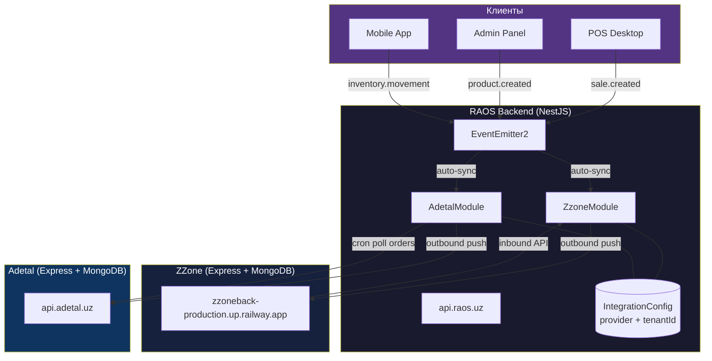
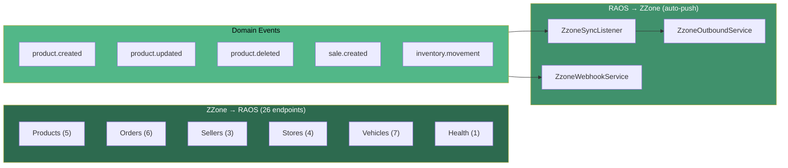
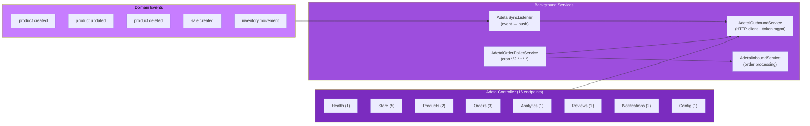
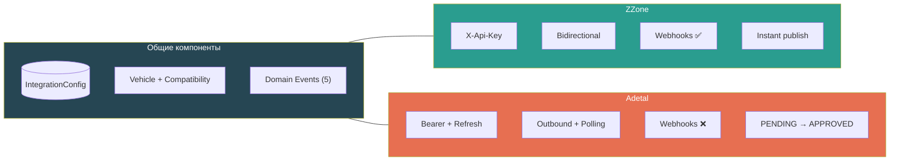
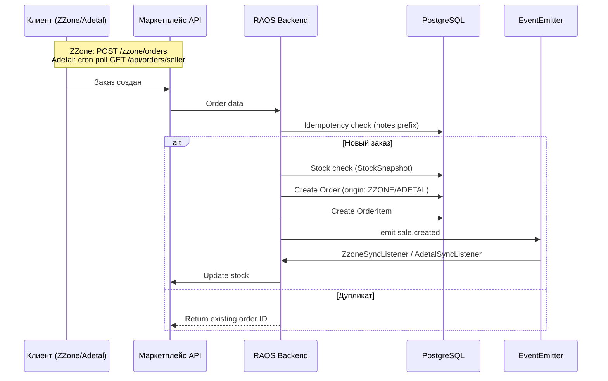
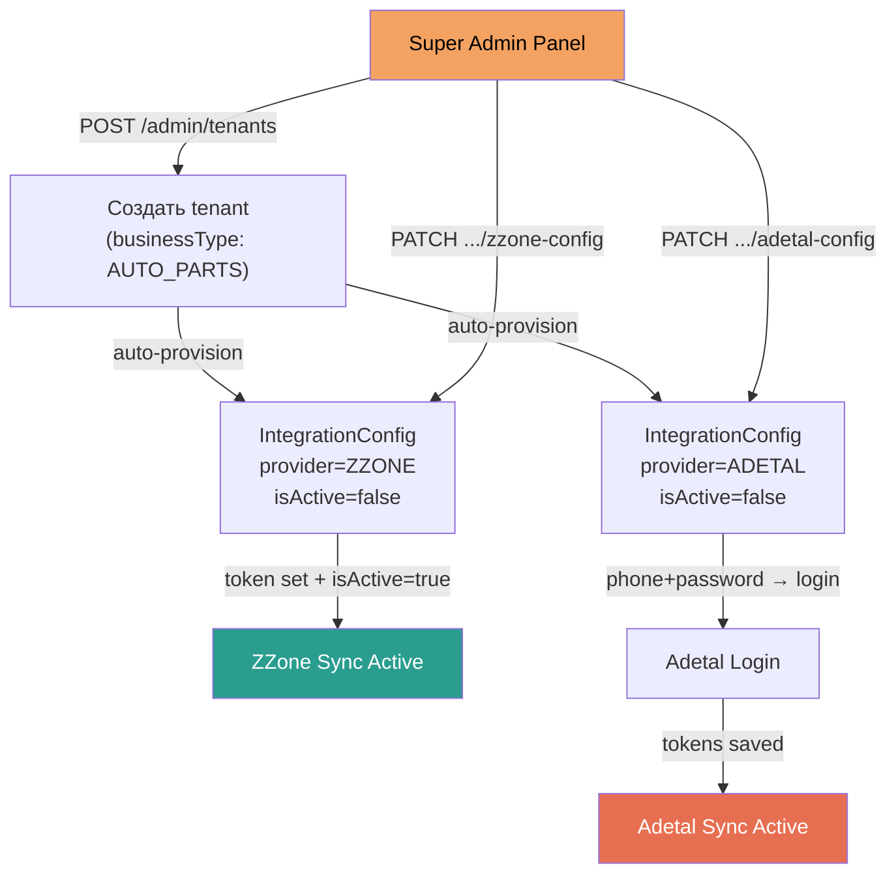
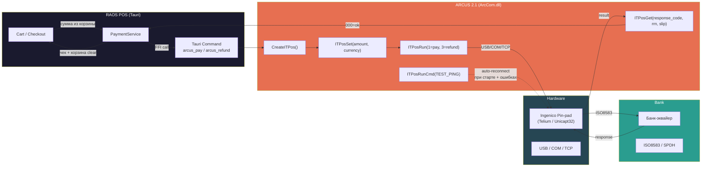
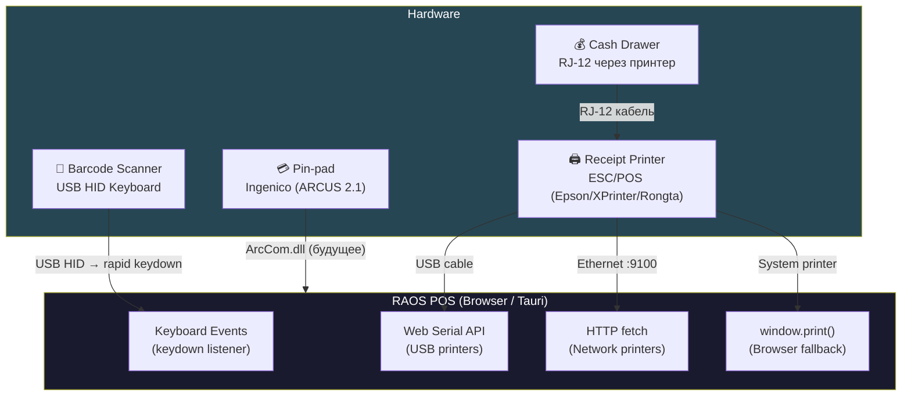

# RAOS Integrations Map

> Obsidian-compatible. Mermaid diagrams render natively.
> Updated: 2026-06-11

---

## Overview



---

## ZZone Integration



**Auth:** `X-Api-Key` header (timing-safe comparison)
**Swagger:** `https://api.raos.uz/api/v1/zzone/docs`
**Docs:** [[RAOS_ZZONE_COLLABORATION]]

| Файл | Назначение |
|------|-----------|
| `zzone.module.ts` | NestJS module |
| `zzone-inbound.controller.ts` | 26 public endpoints (ZZone вызывает) |
| `zzone-inbound.service.ts` | Business logic (products, orders, sellers, stores) |
| `zzone-outbound.service.ts` | HTTP client RAOS → ZZone |
| `zzone-sync.listener.ts` | Auto-sync on domain events |
| `zzone-webhook.service.ts` | Sends webhooks TO ZZone |
| `zzone-webhook.listener.ts` | Bridges events → webhooks |
| `vehicle.controller.ts` | Vehicle CRUD + compatibility |
| `vehicle.service.ts` | Vehicle data management |
| `dto/zzone.dto.ts` | DTOs с class-validator |

---

## Adetal Integration



**Auth:** `Bearer <accessToken>` (auto-refresh, 1h TTL)
**Swagger:** `https://api.raos.uz/api/v1/adetal/docs`
**Docs:** [[RAOS_ADETAL_COLLABORATION]]

| Файл | Назначение |
|------|-----------|
| `adetal.module.ts` | NestJS module |
| `adetal.controller.ts` | 16 endpoints с `@CurrentTenant` isolation |
| `adetal-outbound.service.ts` | HTTP client (12 секций Adetal API) + token refresh |
| `adetal-inbound.service.ts` | Adetal orders → RAOS orders (idempotent) |
| `adetal-sync.listener.ts` | Auto-sync product/stock на domain events |
| `adetal-order-poller.service.ts` | Cron polling заказов каждые 2 мин |
| `adetal.constants.ts` | Status maps, constants |
| `dto/adetal.dto.ts` | DTOs с class-validator + Swagger |

---

## Сравнение интеграций



| Аспект | ZZone | Adetal |
|--------|-------|--------|
| Auth | X-Api-Key (static) | Bearer token (1h + refresh 30d) |
| Direction | Bidirectional | Outbound + polling |
| Webhooks | RAOS → ZZone (4 events) | Нет |
| Product flow | Instant | PENDING → APPROVED |
| Images | URL reference | multipart/form-data |
| Order import | ZZone POST → RAOS | RAOS cron poll → Adetal |
| Endpoints | 26 inbound + outbound | 16 controller + outbound |
| Provider key | `ZZONE` | `ADETAL` |

---

## Data Flow — Order Lifecycle



---

## Admin Config Flow



---

## Файловая структура

```
apps/api/src/integrations/
├── zzone/                          ← ZZone integration
│   ├── zzone.module.ts
│   ├── zzone-inbound.controller.ts  (349 строк, 26 endpoints)
│   ├── zzone-inbound.service.ts     (546 строк)
│   ├── zzone-outbound.service.ts    (122 строк)
│   ├── zzone-sync.listener.ts       (188 строк)
│   ├── zzone-webhook.service.ts     (109 строк)
│   ├── zzone-webhook.listener.ts    (80 строк)
│   ├── vehicle.controller.ts        (154 строк)
│   ├── vehicle.service.ts           (137 строк)
│   └── dto/zzone.dto.ts
│
└── adetal/                          ← Adetal integration
    ├── adetal.module.ts              (18 строк)
    ├── adetal.controller.ts          (192 строк, 16 endpoints)
    ├── adetal-outbound.service.ts    (400 строк)
    ├── adetal-inbound.service.ts     (172 строк)
    ├── adetal-sync.listener.ts       (201 строк)
    ├── adetal-order-poller.service.ts (93 строк)
    ├── adetal.constants.ts           (35 строк)
    └── dto/adetal.dto.ts             (145 строк)
```

---

## Production URLs

| Сервис | URL |
|--------|-----|
| ZZone Swagger | `https://api.raos.uz/api/v1/zzone/docs` |
| ZZone Health | `https://api.raos.uz/api/v1/zzone/health` |
| Adetal Swagger | `https://api.raos.uz/api/v1/adetal/docs` |
| Adetal Health | `https://api.raos.uz/api/v1/adetal/health` |
| ZZone Backend | `https://zzoneback-production.up.railway.app` |
| Adetal Backend | `https://api.adetal.uz` |

---

## ARCUS 2.1 — Bank Terminal (Acquiring)



**Протокол:** ARCUS 2.1 CAP (Ingenico)
**Библиотека:** `ArcCom.dll` (Windows) / `libarcus.so` (Linux)
**Документация:** `ARCUS_2_1_ADMIN_RUS_1_14.pdf` (46 стр.)
**Статус:** Исследование завершено, интеграция не начата

### Операции

| Op ID | Операция | Описание |
|-------|----------|----------|
| 1 | Purchase | Оплата — сумма из корзины RAOS |
| 3 | Refund | Возврат — по RRN |
| 4 | Cancel | Отмена последней операции |
| 7 | Settlement | Сверка итогов (Z-отчёт) |
| 99 | Admin | Меню администрирования |

### Ключевые параметры

| Параметр | IN/OUT | Описание |
|----------|--------|----------|
| `amount` | IN | Сумма в копейках |
| `currency` | IN | `860` = UZS |
| `response_code` | OUT | `000` = одобрено |
| `auth_code` | OUT | Код авторизации |
| `rrn` | IN/OUT | Reference number (для возврата) |
| `pan` | OUT | Маскированный номер карты |
| `slip` | OUT | Текст чека |

### Flow в RAOS POS

```
Кассир пробивает товары → корзина
  → Клиент выбирает "Оплата картой"
  → RAOS отправляет сумму на Pin-pad (ITPosRun(1))
  → Клиент прикладывает карту / вводит PIN
  → response_code=000 → Ledger entry + OFD чек → корзина clear
```

### Проблема клиента (Baraka Market)

COM-порт слетает после отключения электричества / перезагрузки ПО.
**Решение:** `PORT=USB` + `AUTODETECT_OPS=YES` + auto-reconnect с `TEST_PING`.

### Контакт

- Банковский контакт: +998 99 885 43 45 (@ef4345)
- Источник: куратор Абдулазиз Oka Mars (2026-06-13)

---

## POS Hardware Integrations



### Оборудование — статус

| Устройство | Подключение | Протокол | Файл в RAOS | Статус |
|-----------|-------------|----------|-------------|--------|
| Barcode Scanner | USB HID | Keyboard wedge | `hooks/pos/useBarcodeScanner.ts` | ✅ Работает |
| Receipt Printer | USB / Network / Browser | ESC/POS | `components/Receipt/useReceiptPrint.ts` | ✅ Работает |
| Cash Drawer | RJ-12 через принтер | ESC/POS kick | `lib/cashDrawer.ts` | ✅ 3 режима |
| Pin-pad (Terminal) | USB/COM (ARCUS) | ISO8583 | Не реализован | ❌ Ждёт ARCUS |
| Fiscal Module | API (REGOS OFD) | JSON-RPC | `api/src/tax/adapters/regos.adapter.ts` | ⏳ T-081 |

### Cash Drawer — 3 режима

| Режим | Как работает | Команда |
|-------|-------------|---------|
| `network` | POST `http://{ip}:{port}/drawer` → ESC/POS через прокси | `ESC p 0 25 250` |
| `usb` | Web Serial API → прямая отправка байтов на USB-принтер | `ESC p 0 25 250` + `DLE EOT 1` |
| `browser` | Скрытый iframe + `window.print()` с ESC/POS payload | `ESC p 0 25 250` |

### Barcode Scanner — как работает

```
USB сканер = клавиатура (HID)
  → Символы < 100ms друг от друга
  → Enter в конце
  → useBarcodeScanner ловит быстрый ввод
  → Ищет товар по штрих-коду в каталоге
  → Авто-добавляет в корзину + beep
```

---

## Tags

#raos #integrations #zzone #adetal #arcus #acquiring #marketplace #auto-parts #api #hardware #barcode #printer #drawer

---

_INTEGRATIONS_MAP.md | RAOS | 2026-06-14 — POS Hardware section added_
